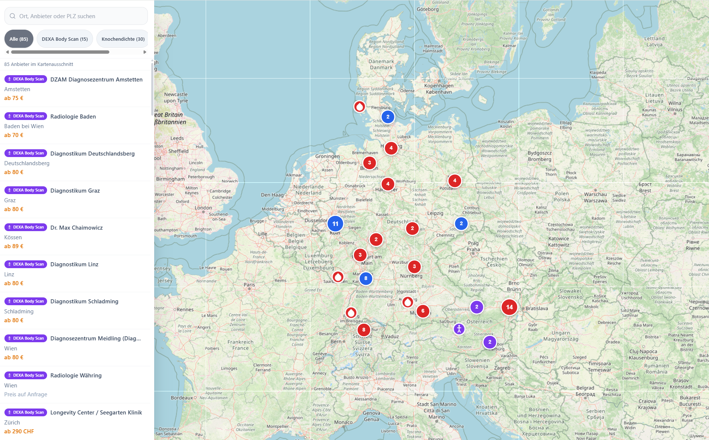
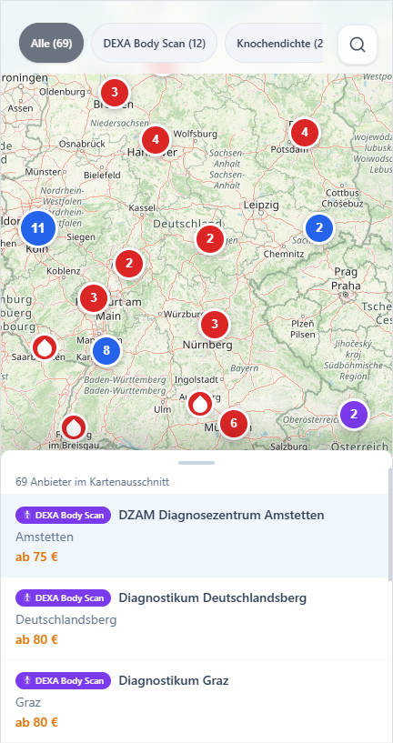
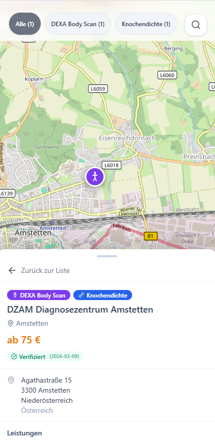

# Laborsuche DACH

Interaktive Karte für drei diagnostische Kategorien im DACH-Raum:

- **DEXA Body Composition Scans** — Ganzkörper-Körperzusammensetzungsanalyse (Fett, Muskelmasse, viszerales Fett)
- **DXA Knochendichtemessung** — Osteodensitometrie zur Osteoporose-Diagnostik
- **Blutuntersuchungen als Selbstzahler** — Labore ohne ärztliche Überweisung

Die wichtigste fachliche Unterscheidung in diesem Projekt:
**DEXA Body Composition ≠ Knochendichtemessung.** Viele Anbieter werben mit „DEXA", meinen aber nur Osteodensitometrie. Diese Unterscheidung ist der Kern der Datenerhebung.

## Ergebnis in Zahlen

| Metrik | Wert |
|---|---:|
| Provider gesamt | 85 |
| DEXA Body Composition | 15 |
| DXA Knochendichte (bone-only) | 17 |
| Blutlabor Selbstzahler | 53 |
| Verifiziert | 85 / 85 (100%) |
| Mit Telefon | 85 / 85 (100%) |
| Mit Adresse | 85 / 85 (100%) |
| Mit öffentlichem Preis | 16 / 85 |
| Länder | DE (57), AT (20), CH (8) |

## Warum eine dritte Kategorie „Knochendichte"?

Die Aufgabe verlangt DEXA Body Composition und Blutlabor. Ich zeige zusätzlich 17 DXA-Knochendichte-Anbieter als eigene Kategorie, weil genau dort der häufigste Recherchefehler passiert: Websites schreiben „DEXA", bieten aber nur Knochendichte an.

Die Kategorie ist kein Scope-Creep, sondern ein Transparenz-Layer: Sie zeigt, welche Treffer im Discovery-Schritt bewusst **nicht** als Body-Composition-Anbieter gezählt wurden. Die 17 Einträge sind kein Versuch einer vollständigen Abdeckung — Knochendichtemessung ist als IGeL-Leistung bei nahezu jeder Radiologie-Praxis verfügbar. Die Einträge stammen aus dem Discovery-Prozess und dokumentieren die bewusste Abgrenzung zu Body Composition.

## Schnellstart

### Voraussetzungen

- Node.js 20+
- npm 10+
- Optional: Docker

### Lokal starten

```bash
npm install
npm run dev
# → http://localhost:3000
```

### Production Build

```bash
npm run build
npm start
```

### Mit Docker

```bash
docker compose up --build
# → http://localhost:3000
```

## Screenshots





## Architektur-Entscheidungen

### Next.js + statisches JSON statt Backend

Für 85 Standorte ist ein Backend nicht nötig. Ein eingechecktes JSON hat für eine Coding Challenge klare Vorteile: Reviewer kann das Ergebnis direkt prüfen, Daten sind versionierbar, kein API-Key nötig, lokaler Start in unter einer Minute.

### Vanilla Leaflet statt Google Maps

Keine API-Kosten, keine Secrets im Repo, sofort lauffähig. Leaflet deckt alle Anforderungen ab: Marker, Clustering, Sidebar-Interaktion, Geolocation, Mobile Bottom Drawer.

### Service-Level statt Provider-Level Modellierung

Ein Anbieter kann gleichzeitig DEXA Body Composition, Knochendichte und Bluttest anbieten. Deshalb ist `services[]` das Kernobjekt — `categories[]` dient nur der UI-Filterung.

### Datenqualität vor Datenmenge

Der Discovery-Teil liefert absichtlich viel zu viele Kandidaten (779). Danach wird streng aussortiert: falsche DEXA-Treffer, generische Labore ohne Selbstzahler-Hinweis, Duplikate, unvollständige Datensätze. Das Verhältnis Discovery → Export (779 → 85) ist bewusst streng.

## Datenerhebung

### Quellen

| Quelle | Einträge | Beschreibung |
|---|---:|---|
| Apify / Google Maps | ~700 Kandidaten | Breite Discovery für DEXA + Blutlabor |
| meindirektlabor.de | 31 Standorte | Offizielle Standortliste (Sonic Healthcare) |
| LLM-Recherche | 37 Einträge | 3 LLMs parallel, händisch verifiziert |
| Manuelle Recherche | ~10 Einträge | Wien, Zürich, Spezialfälle |
| browser-use Validierung | 78 URLs | Automatisierte Nachprüfung aller Einträge |

### Pipeline

```
data/raw/*.json
  → ingest_merge.py      # 779 Kandidaten aus 7 Quellen
  → enrich.py            # Website-Texte laden
  → classify.py          # Keyword-Scoring, Kategorie-Trennung
  → geocode.py           # Koordinaten via Nominatim
  → deduplicate.py       # Domain, Telefon, Geo-Nähe
  → validate_export.py   # Schema-Validierung, Export
  → public/data/providers.json
```

**classify.py** ist das Herzstück: Dual-Axis Keyword-Scoring trennt Body Composition von Knochendichte und echte Selbstzahler-Labore von Radiologien die „Blutentnahme" nur im Kontrastmittel-Kontext erwähnen.

### Verifikation

Die Priorität war Datenqualität vor Datenmenge. Pro Anbieter werden erfasst: Name, Kategorie, Leistungen, Adresse, Koordinaten, Telefon, Website, Selbstzahler-Status, Preise (falls öffentlich), Quelle, Verifikationsstatus.

Verifikationsmethoden:
- Website-Abgleich (Service-Seite bestätigt Leistung)
- LLM-Cross-Check (3 LLMs parallel, nur Übereinstimmungen übernommen)
- browser-use Validierung (automatisierte URL-Prüfung aller Einträge)
- Händische Prüfung aller 15 DEXA Body Comp Anbieter
- Plausibilitätsprüfung (Preise, Telefonnummern, Koordinaten, Duplikate)

## Domänen-Insight: DEXA und Strahlenschutz

### Deutschland

DEXA fällt unter das Strahlenschutzgesetz ([§ 83 StrlSchG](https://www.gesetze-im-internet.de/strlschg/__83.html)). Jede Röntgenanwendung am Menschen braucht eine rechtfertigende Indikation durch eine fachkundige Ärztin oder einen fachkundigen Arzt. „Lifestyle-DXA" ohne medizinische Begründung ist regulatorisch problematisch. Das erklärt, warum es in Deutschland nur 3 offen beworbene DEXA Body Composition Anbieter gibt — die meisten bieten es im sportmedizinischen oder endokrinologischen Kontext an.

### Österreich

Auch hier gilt die [Medizinische Strahlenschutzverordnung](https://www.ris.bka.gv.at/GeltendeFassung.wxe?Abfrage=Bundesnormen&Gesetzesnummer=20010088). In der Praxis sind privat beworbene DXA-Body-Composition-Angebote in Österreich aber deutlich sichtbarer als in Deutschland. Mit 9 Anbietern hat AT die beste Abdeckung im DACH-Raum.

### Schweiz

Die [Verordnung über den Strahlenschutz bei medizinischen Anwendungen](https://www.fedlex.admin.ch/eli/cc/2019/748/de) regelt den Rahmen. DXA-Body-Composition-Angebote existieren, sind aber häufig stärker medizinisch oder sportdiagnostisch gerahmt.

**Wichtig:** Diese Einordnung ist eine arbeitspraktische Recherche-Logik, keine Rechtsberatung.

## Datenmodell

### Provider

```typescript
interface Provider {
  id: string;                    // "dexa-at-001"
  name: string;
  categories: ProviderCategory[];
  address: {
    street: string;
    postalCode: string;
    city: string;
    state: string;
    country: "DE" | "AT" | "CH";
  };
  location: {
    type: "Point";
    coordinates: [number, number]; // [lng, lat] GeoJSON
  };
  contact: {
    phone: string;
    website: string;
    bookingUrl?: string;
  };
  services: ProviderService[];
  selfPay: boolean;
  verified: boolean;
  source: {
    origin: string;
    primaryUrl: string;
    collectedAt: string;
  };
}
```

### Service (pro Leistung)

```typescript
interface ProviderService {
  type: "dexa_body_composition" | "dexa_bone_density" | "blood_test_self_pay";
  name: string;
  selfPay: boolean;
  price?: { amount: number; currency: "EUR" | "CHF"; note: string };
  verification: {
    status: "verified" | "unverified";
    confidence: number;  // 0-1
    date: string;
    method: string;
  };
}
```

### Warum dieses Modell?

- `services[]` ist erweiterbar (neue Leistungstypen ohne Schema-Änderung)
- Verification ist pro Service möglich, nicht nur pro Provider
- `source` macht die Herkunft nachvollziehbar
- `location.coordinates` ist GeoJSON-kompatibel
- Das Format ist direkt API-tauglich

## Features

- **Filter:** Alle / DEXA Body Scan / Knochendichte / Blutlabor mit Live-Zähler
- **Marker-Clustering** bei hoher Dichte
- **Custom Icons:** Körpersilhouette (DEXA), Knochen (Knochendichte), Tropfen (Blutlabor)
- **Farbschema:** Violett (DEXA), Blau (Knochendichte), Rot (Blutlabor)
- **Suche:** Fuzzy-Search nach Name, Stadt, PLZ (fuse.js)
- **Detail-Panel:** Leistungen, Preise, Verifizierung, CTA-Buttons
- **Mobile:** Bottom Drawer mit Snap-Points, Touch-optimierte Tap-Targets
- **Standort-Erkennung:** Browser-Geolocation erkennt den aktuellen Standort und sortiert alle Anbieter automatisch nach Entfernung — der nächste Anbieter steht immer oben
- **CTAs:** Route planen (Google Maps), Anrufen/Nummer kopieren, Website, Termin buchen, WhatsApp teilen — ein Tap genügt
- **Deutsche Karten-Labels** (OSM DE Tiles)
- **Responsive** Desktop-Sidebar + Mobile-Drawer

## Projektstruktur

```
app/                        Next.js App Router
  map/page.tsx              Kartenansicht
components/
  map/                      Karte, Controls, Sidebar
  landing/                  Hero, Navigation
  icons/                    Custom SVG Icons
  ui/                       UI-Primitive (Drawer, Dropdown)
contexts/                   React Contexts (Map, Provider, Theme)
hooks/                      Leaflet- und UI-Hooks
public/data/                Finales providers.json
scripts/process/            Datenpipeline (6 Stufen)
types/                      TypeScript-Datenmodell
data/raw/                   Rohdaten-Samples
```

## Bekannte Grenzen

- Öffentliche Preise sind im Markt selten — fehlende Preise sind absichtlich `null` statt geraten
- Die Rohdaten aus dem Apify-Discovery-Schritt sind als Sample (je 50 Einträge) eingecheckt, nicht vollständig
- DEXA Body Composition in Deutschland ist regulierungsbedingt dünn besetzt (3 Anbieter) — das ist kein Datenleck, sondern Marktgegebenheit

## Was ich bei mehr Zeit noch machen würde

- **Evidenz-Links** pro Service direkt im Datensatz speichern (source_url pro Leistung)
- **Service-spezifische Verifikation** konsequent durchziehen statt teilweise provider-weit
- **Preisextraktion** für Direktlabor-Standorte systematisieren (GOÄ-Preislisten parsen)
- **E2E-Tests** für Karte, Filter und Reset-View (Playwright)
- Bone-only standardmäßig als optionalen **Transparenz-Layer** statt gleichrangige Primärkategorie
- **Automatisches Monitoring** für Änderungen auf Anbieter-Websites

## Tech Stack

| Bereich | Wahl |
|---|---|
| Frontend | Next.js + TypeScript |
| Karte | Leaflet + leaflet.markercluster |
| Suche | fuse.js |
| Styling | Tailwind CSS |
| Datenpipeline | Python |
| Geocoding | geopy / Nominatim |
| Validierung | Pydantic |
| Dedup | rapidfuzz |
| Container | Docker |

## Lokale Verifikation

```bash
npm install
npm run lint
npm run build
npm run dev
docker compose up --build
```
